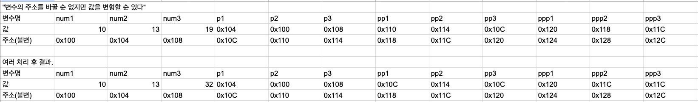
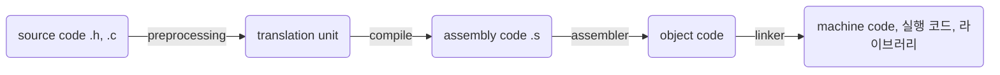
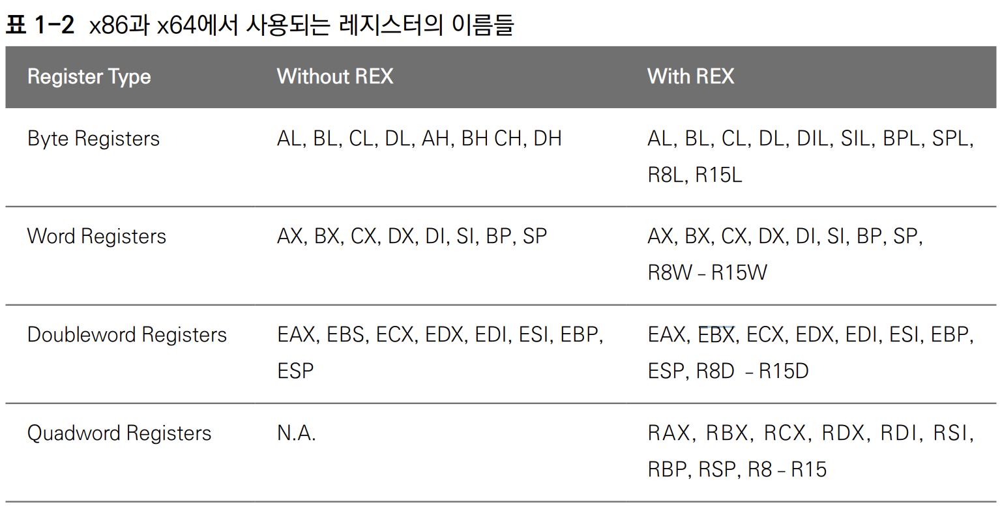

<!-- toc -->

- [clang_tutorial](#clang_tutorial)
  * [권고 사항](#%EA%B6%8C%EA%B3%A0-%EC%82%AC%ED%95%AD)
  * [env settings](#env-settings)
  * [compiler frontend, backend](#compiler-frontend-backend)
  * [MinGW (Minimalist GNU for Windows)](#mingw-minimalist-gnu-for-windows)
  * [명령어 예 clang, lldb, leaks, valgrind...](#%EB%AA%85%EB%A0%B9%EC%96%B4-%EC%98%88-clang-lldb-leaks-valgrind)
    + [clang](#clang)
    + [lldb](#lldb)
    + [leaks](#leaks)
    + [기타 도구들](#%EA%B8%B0%ED%83%80-%EB%8F%84%EA%B5%AC%EB%93%A4)
  * [build process](#build-process)
    + [module & lib](#module--lib)
    + [preprocessor(전처리기)](#preprocessor%EC%A0%84%EC%B2%98%EB%A6%AC%EA%B8%B0)
  * [static, dynamic library](#static-dynamic-library)
    + [modern CMake](#modern-cmake)
  * [register](#register)
    + [registers 종류](#registers-%EC%A2%85%EB%A5%98)
  * [memory](#memory)
    + [mem model](#mem-model)
    + [stack](#stack)
    + [heap](#heap)
    + [data, code](#data-code)
    + [func about mem management](#func-about-mem-management)
    + [mem issues](#mem-issues)
  * [ptr, dereference](#ptr-dereference)
    + [포인터와 함수를 읽는 방법(rt_lt rule)](#%ED%8F%AC%EC%9D%B8%ED%84%B0%EC%99%80-%ED%95%A8%EC%88%98%EB%A5%BC-%EC%9D%BD%EB%8A%94-%EB%B0%A9%EB%B2%95rt_lt-rule)
    + [ptr basic](#ptr-basic)
    + [const ptr](#const-ptr)
    + [function ptr](#function-ptr)
  * [Stream](#stream)
    + [파일 스트림을 다루기](#%ED%8C%8C%EC%9D%BC-%EC%8A%A4%ED%8A%B8%EB%A6%BC%EC%9D%84-%EB%8B%A4%EB%A3%A8%EA%B8%B0)
    + [io](#io)
    + [FILE type](#file-type)
    + [stream indicator](#stream-indicator)
    + [io redirection](#io-redirection)
  * [struct](#struct)
  * [err handing principle](#err-handing-principle)
  * [stdlib](#stdlib)
    + [string.h](#stringh)
  * [standard](#standard)
    + [C89, ANSI](#c89-ansi)
    + [C99](#c99)
    + [C11 및 그 후](#c11-%EB%B0%8F-%EA%B7%B8-%ED%9B%84)
  * [simple assembly](#simple-assembly)
  * [what to do after basic c](#what-to-do-after-basic-c)
  * [youtube](#youtube)

<!-- tocstop -->

# clang_tutorial

## 권고 사항

-   MUST READ DOC.

    -   [doc](https://en.cppreference.com/w/c)
    -   [Microsoft C++, C 및 어셈블러 설명서](https://learn.microsoft.com/ko-kr/cpp/?view=msvc-170)

-   `접두사 혹은 접미사 붙이기`

    -   전역 변수 prefix `g_` 붙이기
    -   NULL이 될 가능성이 존재하는 것은 접미사로 `or_null`을 붙일 것
    -   동적 할당하는 함수가 있다면 접미사로 `_malloc`을 붙일 것
    -   malloc의 결과로 반환된 포인터에는 접두사로 pa\_ (pointer allocated) 를 붙일 것.

-   `문자열`

    -   문자열은 순회하는 등 문자열의 길이에 의존하는 로직을 건드릴 때는 null char가 포함되어 있음을 염두에 두어라.
    -   특정 함수가 마지막에 null char를 넣어주는가를 외우려하지 말고 (매번 문서 보고 확인하는 건 효율이 안 나오니) 방어적으로 buffer[LEN - 1] = '\0'을 넣어주는 것이 좋다.

-   `ptr`

    -   값과 주소를 구별하여 도식 혹은 표를 그려 접근하라.
    -   포인터를 반환하는 함수의 경우 dangling pointer를 조심하라. 함수 내 지역변수를 가리키는 포인터는 함수가 사라지면 stack frame 내에 의도한 값을 가지지 않을 가능성이 높다.
    -   더블 포인터 이상의 경우 헷갈린다면 '변수의 주소를 바꿀 순 없지만 값을 변형할 순 있다'를 염두에 두고 테이블을 그려보라.

    

-   `구조체`

    -   구조체 작성할 때 메모리 패딩을 고려하여 각 요소의 순서를 4의 배수가 되도록 배치하라.
    -   4바이트가 아닌 요소를 구조체 최하단으로 배치하는 휴리스틱이 유용한 편.
    -   #pragma pack을 사용하는 방법도 있지만 비표준.

-   `기타 코드 작성`

    -   전방 선언 꼭 해라. 함수 선언은 필수라 생각해라.
        -   C89 기준 아직 등장하지 않은 함수는 int 반환 함수로 컴파일러가 알아서 가정하기 때문임
    -   한 줄에서 함수 여러 번 호출 하지 말 것 (unspecified behavior)
    -   한 줄에서 동일 변수를 여러 번 바꾸지 말 것 (undefined behavior)
    -   조건문에서는 short circuit evaluation 유의
    -   가급적 모든 변수에 const를 붙이는게 좋다. (rust 기본 동작처럼)
        -   변수가 기본이고 상수가 별도 표기하는 것이 아니라, 관점을 달리해서 기본이 상수로, 변수가 별도 표기하는 것이 좋다고 생각함. 문제는 C-lang와 그 영향을 받은 c-like language들이 이런 관점을 가지고 있지 않다는 것임.
    -   build target (platform) 환경을 알아 두어라.
    -   C에서 모든 자료형은 '값형'이다. 포인터를 넘겨 pass by reference를 구현하는 것이다.
        -   {'a', 'b'}와 같은 꼴로 작성 된 경우 null char가 포함되어 있지 않으므로 주의하라. 애초에 이런 방식으로 문자열을 만들지 않도록 하자.
    -   할당 및 해제를 항상 같이 작성하라.
        -   fopen하면 fclose를 곧바로 작성하라. 잊기 쉽다. 그 외의 다른 리소스들도 마찬가지.
        -   malloc하면 free를 곧바로 작성하라.
    -   va_start/va_end 구문 사이 가독성을 위해 {}를 넣는 것을 추천
    -   모든 함수 및 로직에서 null 체킹을 하는 것은 잘못된 방식이다. 문제의 원인을 찾는 곳은 최소한인 곳이 좋다.
    -   매크로 함수의 구현부에는 괄호()를 칠 것. 의도대로 동작하지 않을 가능성이 높아지고 우선순위가 망가진다.
    -   인라인 함수에 static 넣지 마라. 인라인의 의도인 함수 호출에 대한 오버헤드 제거가 무의미해지고 오히려 코드만 더 생김.

## env settings

[EditUsing Clang in Visual Studio Code](https://code.visualstudio.com/docs/cpp/config-clang-mac)  
[Visual Studio Code C++ July 2021 Update: Disassembly View, Macro Expansion and Windows ARM64 Debugging](https://devblogs.microsoft.com/cppblog/visual-studio-code-c-july-2021-update-disassembly-view-macro-expansion-and-windows-arm64-debugging/#disassembly-view)
[Debug C++ in Visual Studio Code](https://code.visualstudio.com/docs/cpp/cpp-debug)

## compiler frontend, backend

컴파일러는 frontend, backend로 나뉨.
프론트엔드는 소스 코드를 읽고 문법적으로 분석하며 중간 코드(Intermediate Code)를 생성합니다. 이 중간 코드는 프로그램의 의미를 나타내는 중간 표현입니다. 이어서 백엔드가 중간 코드를 가져와서 어셈블리 코드 또는 기계어로 번역하여 실행 파일을 생성합니다.

-   clang
    -   LLVM(Low-Level Virtual Machine) 백엔드를 사용하는 계열
    -   gcc 사용 인터페이스를 거의 비슷함. mac에서 gcc는 clang을 wrapping한 것일 정도.
    -   보통 이걸 쓰게 된다.
-   gcc (GNU Compiler Collection)
    -   거의 모든 표준 지원 + cross platform
    -   그래서 GCC의 각 아키텍처별 백엔드는 해당 아키텍처의 이름이라. (ARM 아키텍처, RISC-V 아키텍처, ...)
-   MS visual C++
    -   MASM(Microsoft Macro Assembler) 백엔드를 사용함.
    -   cpp 컴파일러임에도 .c 확장자면 컴파일함.
    -   C99 표준. C11은 거의 지원하지 않음.
    -   window에서는 이 컴파일러를 사용하는 경우가 많음.

## MinGW (Minimalist GNU for Windows)

Windows 운영 체제에서 GNU 도구 체인과 호환되는 프론트엔드를 포함한 개발 도구의 모음입니다.

## 명령어 예 clang, lldb, leaks, valgrind...

### clang

[clang docs](https://clang.llvm.org/docs/ClangCommandLineReference.html)

```bash
clang -std=c89 -W -Wall -pedantic-errors $file

clang -E $file # preprocessor output (translation unit)
clang -S $file # assembly output
clang -c $file # object output

# for your convenience
nodemon --exec "clang $file && ./a.out" -e c
```

### lldb

https://lldb.llvm.org/use/tutorial.html

```bash
clang -g ./main.c
lldb ./a.out
b main.c:30 # 30번째 줄에 breakpoint 걸기
r # 진행
n # 한 줄 씩
```

### leaks

안 다뤄봄. 메모리 누수 탐지에 용이함.

### 기타 도구들

> 지금 와서 C 코드를 짜야 한다면 무조건 메모리 안전성을 확인해 주는 도구를 사용해야 한다. 이를테면 Zed Shaw의 《깐깐하게 배우는 C(Learn C the Hard Way)》에서는 초장에 바로 valgrind를 쓰도록 하고 있다.
>
> -   https://hut.mearie.org/c-language/

https://github.com/nothings/single_file_libs

## build process



-   모든 c 파일을 컴파일하여 object code로 만들어 놓고 마지막에 linking 작업을 함

-   전처리(preprocessing)
    -   전처리기라는 별도의 프로그램이 담당하곤 함.
    -   주석 제거, 매크로 확장, include한 내용을 붙여 넣기 등.
    -   위 과정을 거쳐 만들어진 것이 확장된 소스 코드 = translation unit
-   compile
    -   assembly 언어를 뱉음. 특정 target platform에 종속적임.
-   assemble
    -   0과 1로 이루어진 기계어이긴 하지만 아직 linking을 거치지 않아 기계가 실행할 순 없음.
-   linker
    -   obj 코드를 모아 linking. 여러 obj 파일을 하나의 실행 파일로 만듦.

### module & lib

-   header(.h)와 c파일(.c)

    -   c 파일
        -   로직 코드 존재. 함수 정의, 전역 변수, 매크로 등.
    -   header 파일
        -   공유하고자 하는 것 정의. 함수 선언, 매크로, extern 등. #include 구문으로 포함함.

-   `#include <>` vs `#include ""`

    -   디스크 상 어디에서 header 파일을 찾는가?의 차이
    -   <>는 시스템 경로. 즉, C에서 제공하는 기본 라이브러리를 include할 때 주로 사용
    -   ""는 현재 work dir에서 먼저 찾고 없으면 시스템 경로에서 찾음.
    -   즉, 직접 만든 header는 ""로, 기본 라이브러리는 <>로 include 하자.

-   extern

    -   '외부 변수'. .h든 .c든 extern이 선언되면 '나 외부에 있는 것을 사용하겠다'는 의미.

-   static

    -   지역 변수(함수의 매개 변수 포함)은 block scope 벗어나면 무시됨. 그러나 static 지역 변수를 선언하면 함수 호출이 끝나고 GC 당하지 않고 계속 유지 된다.
    -   static 지역 변수는 사실상 전역 변수처럼 프로그램이 종료될 때까지 메모리에 남아있음. 따라서 둘 다 프로세스가 종료할 때 까지 메모리 주소를 유지하는데에는 차이가 없다.
        -   그렇다면 왜 static 지역 변수를 사용하는가?
        -   static 지역 변수의 의의는 선언된 파일 내 혹은 블록 내에서만 사용할 수 있으며 extern으로 호출하여도 Undefined symbols 에러가 발생한다는 점.
            -   static 지역 변수 : 해당 함수 스코프 내에서만 접근 가능.
            -   static 전역 변수 : 선언된 파일 스코프(.c, .h) 내에서만 접근 가능하며 extern 불가
    -   static 변수를 선언하고, 해당 변수를 mutable하는 별도 함수를 만들어 호출하는 방법이 안전함. 일종의 setter 함수.
    -   `_s` 붙이는 컨벤션 권고.

-   circular header include
    -   include guard를 사용하자.
    -   #ifndef, #define, #endif를 사용하여 중복 include를 방지하는 것.
    -   #pragma once를 사용할 수도 있으나 표준은 아님.

### [preprocessor(전처리기)](https://en.cppreference.com/w/c/preprocessor)

전처리기 연산자

`#` 혹은 `##`

전처리기가 하는 일(cppref 사이트에 다 적혀 있다...)

1. 다른 파일을 include (#include)
2. 매크로를 다른 텍스트로 대체 (#define, #undef)
3. 소스 파일의 일부를 조건부로 컴파일 (#if, #ifdef, #ifndef, #else #elif, #endif)
4. 일부러 오류 발생 (#error)

[Predefined Macro Symbols](https://en.cppreference.com/w/c/preprocessor/replace#Predefined_macros)

`__FILE__` : 현재 파일 이름
`__LINE__` : 현재 줄 번호
`__STDC_VERSION__` : C 표준 버전
... 이하 공식 문서 찾아볼 것.

macro function

장. 함수 호출에 따른 오버로드가 없음.  
단. 그런데 디버깅하기 힘듦. breakpoint? 안 걸림. 뇌지컬로 뚫어야 함.

## static, dynamic library

-   static library vs dynamic library

    -   정적 라이브러리는 라이브러리 + 내 코드가 합쳐져서 컴파일되고 실행 파일에 포함됨. 실행 파일이 커짐.
        -   즉, 정적 라이브러리는 만들어 놓고 코드에 복붙하는 것과 같다.
        -   실행이 빠른 장점이 있긴 함.
    -   동적 라이브는 이미 존재하는 내 실행 파일에서 실행할 때 lazy하게 동적 라이브러리를 로딩하여 링킹이 진행됨.
        -   실행하다가 필요한 코드를 건드리면 동적 라이브러리가 로드됨
        -   흔히 보는 `dll`이 `dynamic link library`의 약자임.
        -   여러 실행 파일들이 동일한 라이브러리를 공유하여 메모리를 절약할 수 있는 장점

-   정적 라이브러리

1. 라이브러리 소스코드 `.c` 파일을 object code까지 컴파일 함 (-c)
   `clang -c lib_source.c -o lib_source.o`

2. `llvm-ar`(window 계열), `ar`(리눅스 계열)를 사용하여 object code를 archive로 묶음. 그 결과 `.lib` (window 계열), `.a` (리눅스 계열. '아카이브')
   `llvm-ar -rc ../lib/custom.lib lib_source.o`

3. lib를 사용할 코드에서 헤더 파일을 #include "" 하여 사용. (<>가 아님에 주의.)
   단, 경로는 컴파일 시 지정해주어야 함.

-   `-I` : 헤더파일 검색 경로 추가
-   `-L` : .lib, .a 파일이 있는 폴더
-   `-l` : 사용할 라이브러리(특이하게 -l 플래그 뒤 띄어쓰기를 하지 않고 적어야 함)

```
clang
    -std=c89
    -W -W -pedantic-errors
    -I <dir> -L <dir> -l<lib_name> *.c
\\
clang -I "../lib_source" -L "../lib" -lcustom_lib *.c
```

4. 실행 파일과 정적 라이브러리를 함께 링킹하여 최종 빌드함.

-   동적 라이브러리

`.dll`(window 계열), `.so`(리눅스 계열)
헤더 파일을 #include하여 사용
컴파일 할 때 동적 라이브러리와 함께 링킹
배포할 때도 동적 라이브러리와 함께 배포(게임 받으면 보통 dll도 딸려오잖아)

동적 라이브러리 내부 포맷
리눅스 계열은 ELF(executable and linkable format)라는 포맷을 사용함.
윈도우는 PE(portable executable) 포맷을 사용함.

동적 링킹 작업은 OS의 dynamic linker가 담당.
프로그램이 실행될 때 필요한 동적 라이브러리를 로딩 후 링킹해 줌.
동적 라이브러리 함수 및 값들을 메모리에 로드 및 매핑해야 하는데 이 정보가 포맷에 저장되어 있으므로 동적 라이브러리는 OS에 종속적임.

### modern CMake

C/Cpp 버전은 하위를 쓰더라도 build process는 최신 방식을 쓰자.  
3.0 이상의 modern CMake를 권고함.

[official site](https://cmake.org/)  
[An Introduction to Modern CMake](https://cliutils.gitlab.io/modern-cmake/)  
[effective_modern_cmake](https://gist.github.com/mbinna/c61dbb39bca0e4fb7d1f73b0d66a4fd1)

## register

메모리 접근 속도가 느려서 cpu와 DRAM 소통 하기 전에 SRAM을 캐슁으로 사용하는 개념 = register

cpu --bus--> RAM
cpu --bus--> DISK

각 속도 차이가 매우 큼.

-   메모리는 HDD 보다 **10^5 ~ 10^6** 정도 빠르다.

    -   왜? 물리적으로 헤더가 움직여야 하므로 느림.
    -   -   SSD는 물리적으로 탐색하지 않아 비교적 빠르다. 그러나 CPU로의 전송 속도 차이는 여전.
    -   연산을 위해 CPU 버스 태우는 전송 속도도 느리다. 메모리-cpu는 계산 때려보니 **9GB/sec** 정도이지만 Disk-cpu는 **80MB/sec**. 정말 어마어마한 차이.

DRAM : 저렴. 기록 유지를 위해 주기적으로 data write 필요
SRAM : 정적램. 작성하면 다시 지워지지 않아 static. 다만 비용 비쌈.

cpu와 DRAM 사이에 SRAM을 두자. 그것이 register.
cpu가 연산할 대상을 register에 올려놓고 연산을 수행한다. 그 후 DRAM으로 write back하는 과정으로 cpu-ram 사이의 작업.

### registers 종류

일반적인 x86 아키텍처에서는 아래 레지스터들이 존재.

-   8개 범용 레지스터 (esp, ebp, eax, ebx, ecx, edx, ...)
-   6개 세그먼트 레지스터
-   1개 플래그 레지스터
-   1개 명령어 포인터

ebp : base pointer
esp : stack pointer

e.x 꼴을 따르고 있는 종류들.
eax : extended accumulator register
ebx : extended base register
ecx : extended counter register
edx : extended data register



## memory

### mem model

```

stack : 위(큰 주소)에서 아래(작은 주소)로
heap : 아래(작은 주소)에서 위(큰 주소)로
data : 전역 변수, static 변수, 문자열 리터럴
code : 함수 코드

```

-   보통 개발하면서 신경쓰는 부분은 stack, heap이라 이 부분을 알아둬야.

### stack

-   thread and stack

    -   stack은 프로그램의 thread 마다 각자의 용도에 맞게 사용하도록 떼어준 공간.
    -   process간 독립된 mem model을 지니고 있다면, thread는 stack을 제외한 영역을 공유한다.
    -   stackless thread 사용하지 않는 이상 thread 생성 시 stack size를 지정할 수 있다.

-   `stack`

    -   [함수 호출 규약 (calling convention)](https://en.wikipedia.org/wiki/Calling_convention)
        -   함수를 호출할 때 stack에 어떤 것이 어떤 순서로 들어가는 지에 대한 규약.
    -   스택은 매개 변수, 지역 변수가 저장되는 곳이다. 함수의 호출과 함께 할당되며 함수의 호출이 완료되면 해당 부분을 사용하지 않는다. 지우는 것도 컴퓨팅 리소스가 필요한 일이기에. 나중에 필요하면 덮어 쓰는 방식임. (함수 자체는 code에 올라가고, 함수 내 사용하는 변수들이 stack에 올라감)
    -   함수를 오고가면서 EBP, ESP를 옮겨가고 함수 내 변수 등은 그 사이인 stack pointer에 존재함
    -   <u>스택 메모리의 크기는 프로그램 빌드 시(컴파일 타임)에 결정되며 스택 메모리의 위치는 실행 시(런타임)에 결정됨.</u>
    -   변수를 선언하면 stack 영역에 할당된다고 알아두자.
    -   값형(value)를 call by value하면 스택에 복사본을 만듦.
    -   너무 큰 데이터는 stack에 넣으면 안된다. 이럴 때는 ‘동적 메모리 할당'하는게 좋다. os에게 메모리 달라고 부탁하는 것.

-   `stack frame`

    -   각 함수가 사용하는 스택 메모리의 범위. EBP와 ESP 사이의 범위.
    -   함수 2개 정의해놓고 호출한다면 EBP, ESP 왔다갔다 하면서 stack frame 2개 정도 잡아놓고 쓰다가 호출 완료되면 쓰지 않는다.
    -   적극적으로 할당한 값을 메모리에서 지우지 않고 그냥 사용하지 않는다.

-   `stack pointer`

    -   `EBP` (extended based pointer) : 스택 프레임의 첫 주소. Base라는 단어에 집중. → stack의 top. 현재 stack frame이 어디에 있는지 알게 해주는 포인터.
    -   `ESP` (extended stack pointer) : 현재 스택 포인터 → stack의 bottom. 현재 stack frame이 어디 까지 차 있는지 보여주는 포인터이기도 함.

-   `call stack`
    -   stack 자료구조의 LIFO 특성이 stack 메모리에도 적용된다. 함수의 특성상 나중에 호출된 함수가 반환되지 않음녀 전에 쌓인 스택은 반환되지 않는다. 이런 특성을 이용해 함수의 호출과 반환을 관리하는 메모리 영역을 call stack이라고 한다.
    -   clang windows 기준 stack은 1MB 정도 된다고 한다. 얼마 되지 않기 때문에 재귀 호출할 때 탈출문을 제대로 작성하지 않으면 call stack 터지곤한다. stack 관점에서 보자면 함수 호출할 때마다 stack frame을 할당하는데 이게 계속 쌓이다보니 stack 메모리가 부족해져서 발생하는 문제다.

### heap

-   stack과 달리 compiler, cpu 등이 메모리 관리를 해주지 않고 코더가 직접 관리하는 영역.
    -   너무 큰 데이터는 stack에 넣으면 안된다. (비디오 처리와 같은 경우) 이럴 때는 heap을 활용해 ‘동적 메모리 할당'하는게 좋다.
    -   DMA(dynamic memory allocation)
-   용량 제한이 없다 (컴퓨터에 남은 메모리 만큼 사용 가능)
-   코더가 데이터 수명을 직접 제어. stack의 경우 함수 호출이 끝나면 해당 영역은 방치된다.

-   stack과의 비교

    -   stack: 정적 메모리. 할당/해제가 컴파일 시점에서 결정됨.
    -   heap: 동적 메모리. 실행 중 크기와 할당/해제 시점을 결정할 수 있다.

-   단점

    -   `메모리 누수`
        -   만약 heap을 빌려간 측에서 메모리 주소를 해제하지 않는다면 메모리 누수가 발생한다.
    -   stack에 비해 할당, 해제 속도가 느리다.
        -   offset 기반으로 움직이는 stack과 달리 할당하고자 하는 메모리 공간을 찾아야 하므로(메모리 조각화) 속도가 느리다.

-   `동적 메모리 할당`

    -   최대한 정적 메모리를 사용하고, 동적 메모리는 최소한으로 사용하는 것이 좋다.
    -   메모리 할당 -> 사용 -> 해제
        -   1. 힙 관리자에게 n byte만큼을 달라 요청
        -   2. 반환된 포인터를 활용
        -   3. 힙 관리자에게 반환

-   <stdlib.h>

    -   malloc(할당)
    -   calloc(할당)
    -   [realloc(재할당)](https://en.cppreference.com/w/c/memory/realloc)
    -   free(해제)

-   동적 할당 작성시 원칙

-   할당

    1. malloc으로 할당 받은 포인터는 복사하여 사용하라.
        - 해당 주소가 바뀌면 free할 수가 없기 때문이다.
    2. realloc을 한다고 했을 때 동일한 포인터를 반환받을 수 있을 지는 모른다.
    3. realloc의 반환값은 항상 임시 포인터 변수에 담은 후 NULL이 아닌 것을 체크한 후에 원래 포인터에 대입할 것.
        - realloc이 실패하면 기존 메모리를 해제하지 않고, 원래 ptr 주소를 상실해서 메모리 누수가 발생할 수 있음.

-   해제
    1. free 먼저 작성.
        - 특히 지역 변수 내 malloc한 경우 함수 종료 시 그냥 나가버리면 해당 메모리 주소를 잃어버리게 되어 free할 수 없으니 유의.
    2. free한 뒤에 변수에 NULL을 대입하여 초기화 할 것
        -   1. null ptr는 free로 전달해도 안전함.
        -   2. 해제된 것이라는 것은 명확히 함.
    3. 기타 free 주의점
        - free한 메모리를 또 free하면 안 됨
        - 해제만 메모리를 사용하려고 하면 안 됨

### data, code

-   data
    -   전역변수는 데이터 섹션에 저장
    -   문자열 리터럴은 일반적으로 프로그램의 데이터 섹션에 저장됩니다. 이러한 문자열은 읽기 전용(read-only)일 수 있으며, 프로그램 실행 중에 수정할 수 없습니다. 따라서 문자열 리터럴은 변경할 수 없는 상수(constant)로 취급됩니다.
-   code

### func about mem management

-   memset, memcpy, memcmp

### mem issues

-   dangling ptr

    -   함수에서 포인터 변수를 반환할 때 주의하라.
    -   함수 내 지역변수가 존재하는 stack frame은 함수가 return되면 방치 된다. 추후 동작에 따라서 해당 메모리는 다른 것이 덮어 쓰게 된다.
    -   따라서 함수는 포인터 변수를 반환하면 안된다. 유효하지 않은 주소를 반환하기 때문이다.
    -   함수 반환 값이 ptr이어도 되는 경우
        -   전역 변수
        -   파일 속 static 전역 변수
        -   함수 내 static 변수
        -   heap에 생성한 데이터

-   memory stomp

    -   프로그램 내 다른 변수가 저장된 메모리를 덮어쓰는 것

-   segmentation fault의 원인
    -   null 값을 가리키는 포인터에 접근할 경우
    -   할당 받은 메모리 공간을 넘은 곳을 건드린 경우
    -   더 이상 존재하지 않는 메모리 영역을 가리킬 경우
    -   read-only 표시 메모리 영역에 쓰려고 할 경우

## ptr, dereference

### 포인터와 함수를 읽는 방법(rt_lt rule)

꽤나 복잡해지기 때문에 알아두어야 한다.
right-left rule(rt_lt rule)은 매우 중요하다!
[rt_lt rule](https://cseweb.ucsd.edu/~gbournou/CSE131/rt_lt.rule.html)

1.  Start reading from the identifier
2.  go right, and then go left. When you encounter parentheses, the direction should be reversed.
3.  If you hit a left parenthesis, that's the beginning of a () symbol, even if there is stuff in between the parentheses.

각 symbol은 아래처럼 영문 번역하는 것이 쉽다.

-   as "pointer to" - always on the left side
-   [] as "array of" - always on the right side
-   () as "function returning" - always on the right side

```c
int *a; // a is pointer to int
int **a; // a is pointer to pointer to int
int *p[]; // p is array of pointer to int
int (*p)(char); // p is pointer to function (char) -> int
int (*f[2])(float, float); // f is array of pointers to (float, float) -> int
char (*foo)(void*) // foo is pointer to (void*) -> char
int* (*foo)(int, void(*)(int)) // foo is pointer to (int, void(*)(int)) -> int*
void (*func(int, void (*)(int)))(int); // func is function retuning pointer to function (int) -> void
int (*(*fun_one)(char *,double))[9][20]; // fun_one is pointer to function expecting (char *,double) and returning pointer to array (size 9) of array (size 20) of int.
void (*(*f[])())() // f is array of pointer to function () -> pointer to function () -> void
```

### ptr basic

-   pointer = 주소를 저장하는 변수 (참조)

    -   `int* p_num`과 `int *p_num`은 같다.
    -   int\* = pointer to int
    -   int\* = pointer to int\*
    -   x64에선 8byte, x86에선 4byte. 즉, word size 크기임.
        -   sizeof(short\*) == sizeof(double\*)
        -   ptr의 좌측 자료형은 해당 포인터가 무엇을 가리키고 있는 지에 대한 정보이지 크기를 나타내는 것이 아니다.
    -   call by value, call by reference 개념은 C에서 구분이 무익하다. 엄밀히 따지면 ptr 값을 복사해서 함수 내부에서 사용하는 것이다. 다만 메모리 주소를 통해 직접 값을 변경하기 때문에 그 변경이 원본에도 반영된다. 동작만 보면 call by reference와 같다. ptr를 함수에 넘겼음은 대부분 원본을 mutable하는 의도를 가졌을 것이다.
    -   타 언어에서 기본 자료형을 제외하고는 모두 포인터라 봐도 무방하다. instance, object, , list, arr, ...
    -   arr를 가리키는 ptr에 정수를 더하거나 빼는 것은 (++, -- 도 포함) 다음 원소 주소로의 이동을 의미한다. 배열을 가리키는 ptr에서 주로 사용되나 일반 값을 나타내는 ptr에서도 적용된다.

-   arr ptr

    -   ptr에 배열 할당하면 배열 첫 원소의 주소를 가리키는 ptr이 된다.

-   dereference(역참조)

    -   포인터가 가리키는 주소에 저장된 값을 가져오는 것
    -   역참조를 통해 값 변경을 가능

-   null ptr

    -   (void\*)0을 가리키는 ptr
    -   null handling을 위해 assert, early return, 접미사 붙이기 등 프로그래밍 가시성을 높이자.
    -   역참조한 결과는 표준에 정의되지 않음.

-   void\*
    -   어떠한 포인터라도 대입 가능함.

### const ptr

    -   `int* const`
        -   주소를 보호하는 ptr
        -   <u>포인터의 메모리를 고정하고 싶을 때 사용함. 메모리가 가리키는 값은 변경 가능</u>
            -   ```c
                int* const p = &a;
                *p = b; // ok
                p = &b; // error
                p++;    // error
                ```
        -   ptr = &new 꼴 불가.
    -   `const int*`, `int const*`
        -   값을 보호하는 ptr
        -   <u>포인터가 가리키는 값을 고정하고 싶을 때 사용함. 포인터가 담은 메모리 주소를 변경 가능</u>
        -   \*ptr = new 꼴 불가.
        -   ptr를 통한 값 변경을 막는 것이지 값 자체는 바꿀 수 있음.
            -   ```c
                const int* p = &a;
                a = 10; // ok
                p = &b; // ok
                *p = 5; // error
                ```
        -   직관적으로, const int가 정수 값 보호를 말하기에 const int\* 형태가 가장 많이 사용됨

### function ptr

기본 annotation은 `반환형 (*변수명)(매개변수 목록)` 이다.

## Stream

스트림?
OS가 제공하는 입출려 장치와 실행 중인 프로세스를 연결하는 데이터 통로.
콘솔(키보드, 모니터)은 표준 스트림에 해당하여 따로 스트림 생성을 OS에게 요청할 필요 없으나 파일 스트림등은 직접 스트림 생성을 요구해야 한다.(file open)

buffer?
스트림에서 버퍼에 저장한 뒤 일정한 chunk로 잘라 프로세스에게 제공된다.
fgets로 문자열 단위로 읽을 때 enter를 치면 스트림을 거쳐 입력 버퍼에 저장된다.
버퍼에 내용이 생겼으므로 fgets는 버퍼에서 문자를 읽어올 수 있다.
여기서, 전송되고 남은 문자들은 여전히 버퍼에 남아 있다.

### 파일 스트림을 다루기

1. 파일을 열어 파일 스트림을 생성한다. (fopen)
2. 파일 스트림을 활용한다. (fread, fwrite, fgets, ...)
3. 파일을 닫는다. (fclose)

### [io](https://en.cppreference.com/w/c/io)

메모리뷰랑 디버거 켜놓고 짚어봐야 한다.

-   입력 받기의 전략

1. 한 글자씩 읽기

    - [getchar](https://en.cppreference.com/w/c/io/getchar), fgetc(putchar, fputc) : 한 글자씩 읽고 쓴다.

2. 한 줄씩 읽기(문자열 단위)
    - [fgets](https://en.cppreference.com/w/c/io/fgets)
        - char *fgets( char *str, int count, FILE \*stream );
        - stream에서 count-1만큼 읽어서 str에 쓴다.
        - `개행문자도 읽어온다.` 따라서 strlen을 찍으면 \n 까지 읽어서 반환한다. -> 개행문자가 싫다면 scanf
        - `마지막에 \0(null char) 를 붙여`준다. 하지만 신뢰하지 말고 코드로 len - 1에 null char를 넣어주자.
        - 공백이 있는 문자열을 받기 위해서 scanf 대신 fgets를 쓰는게 편리한 편.
    - gets는 쓰지 말자.
3. 한 데이터씩 읽기(형식화된 데이터)
    - [scanf](https://en.cppreference.com/w/c/io/fscanf)
    - 데이터를 구분 짓는 기준이 공백임. 따라서 공백을 잘라 읽는다. i love you 에서 i만 읽어옴. scanf는 문자열을 입력받기에 적절하지 않음. fgets나 다른 함수를 권고함.
4. 한 블록씩 읽기 (이진 데이터)
    - [fread](https://en.cppreference.com/w/c/io/fread)

C로 사용자 입력을 받았을 때 권장되는 방식은 `fgets`와 `sscanf`

### [FILE type](https://en.cppreference.com/w/c/io/FILE)

FILE type?

"스트림을 제어하기 위해 필요한 정보를 담고 있는 자료형"

스트림을 제어하기 위해 필요한 정보?

1. 파일 위치 표시자(file position indicator)
2. 스트림이 사용하는 버퍼의 포인터
3. 읽기/쓰기 중에 발생한 오류를 기록하는 오류 표시자
4. 파일의 끝에 도달했음을 기록하는 EOF 지시자

이외에도 공식 문서 가면 FILE이 일반적으로 가지고 있는 것들이 많다. 읽어보라.

Each FILE object denotes a C stream.
입력 출력 스트림은 오직 FILE 포인터로만 접근 및 조작 가능

파일 스트림이란 것은 소켓, 파이프 등등을 통칭하는 것이다.

### stream indicator

stream에는 3개의 표시자(indicator)가 존재.

End-of-file status indicator. (EOF 표시자)
Error status indicator. (오류 표시자)
file position indicator (파일 위치 표시자)

indicator를 조정하는 여러 함수들 존재

[ftell](https://en.cppreference.com/w/c/io/ftell) : Returns the file position indicator for the file stream stream
[rewind](https://en.cppreference.com/w/c/io/rewind) : file position indicator를 처음으로 이동
[fseek](https://en.cppreference.com/w/c/io/fseek) : Sets the file position indicator for the file stream stream to the value pointed to by offset.

### io redirection

```text
./a.out < input.txt
./a.out > output.txt
./a.out < input.txt > output.txt
./a.out 2> error.txt
```

## struct

## err handing principle

-   버그와 오류

    -   버그(bug) : 일어날 수 없다고 가정한 것. 프로그램에서 대응할 수 없음. 다시 만들어야 함.
    -   오류(error) : 실제 실행 중 일어날 수 있는 예외적 상황. 프로그램에서 대처해야 함.

-   버그 대응

    -   try/catch/finally 구문이 C에는 없다.
    -   crush 내용을 수집해야 함.
    -   os가 던져주는 signal을 받아서 처리할 수는 있긴 함. 그러나 문제가 프로그램단에서 해결할 수 없는 다른 에러인 경우도 잦음.
    -   코드 수정

-   오류 대응
    -   C에서는 exception이 없음.
    -   오류 상황을 처리하는 로직은 최소한으로, 가급적 빠르게 null을 쳐낼 것.
        -   그 이후 사용되는 데이터는 유효성을 만족한 것이라고 가정하고 assert로 검증할 것.
    -   오류 코드를 사용하라. 모든 오류 코드는 하나의 enum으로 만들어서 관리하는 것이 유용하다.
    -   errno는 외부 라이브러리인 경우 신경을 안 쓴 채로 작성한 경우가 많기 때문에 신뢰하기 어려운 경우가 있다. 그래서 그냥 오류 코드를 직접 만들어서 사용하는 것이 좋다.
    -   경계 조건(boundary)에서 데이터 유효성 검사 필수.
        -   내 프로그램 vs (파일 시스템, 키보드 입력, 외부 라이브러리, DB 호출 결과값, 다른 서비스 호출 결과값, ...)
        -   외부 세계에서 null이 들어오면 assertion으로 쳐내야지 받아내면 안된다. 혹여나 null을 허용한다면 함수 , 메서드 이름이나 주석으로 문서화해야 함.

## stdlib

### [string.h](https://en.cppreference.com/w/c/string/byte)

-   전반적으로 'dest'가 의도보다 크기가 작다면 남의 메모리를 밟거나 컴파일이 되지 않는 등의 문제가 발생합니다.
-   C11에 `_s` 접미사가 붙은 secure 함수가 추가됨.
-   strcpy, strcat 등 작업 후 반환되는 문자열에는 무조건 마지막에 null char를 넣어주도록하자. null char가 원래 있었다면 상관 없고, 없었다면 위험한 문자열이기 때문이다.
-   C89에 n 붙은 메서드 제공 안함. C99부터 제공함.
-   타 언어와 달리 임시 문자열을 생성해주는 등의 부가 작업을 해주지 않고, 포인터를 활용해 메모리 추가 할당 없이 최대한 작업하려고 함. 따라서, 메모리 관리에 대한 책임은 코더에게 있다.

-   strlen

    -   O(n)입니다. 그래서 가급적 C에서 문자열을 다룰 때는 문자열의 길이를 알고 있는 것이 좋습니다.
    -   strlen은 null char를 제외한 길이를 반환한다.

-   strcmp, strncmp

    ```c
    // love가 완성되면 cnt 올리기
    if (strncmp(p_buff, "love", 4) == 0) {
        love_cnt++;
    }
    ```

-   strcpy, strncpy
    -   전에 있던 dest는 덮어씌워지게 됩니다. dest의 크기가 src보다 작다면 문제가 발생합니다.
    -   기본적으로 null char를 붙여주려고는 하나 src의 길이가 n보다 큰 경우에는 null char를 붙여주지 않습니다.
    -   strncpy(dest, src, n)은 src 문자열에서 최대 n 개의 문자를 dest 문자열로 복사합니다.
        -   src의 길이가 n보다 작은 경우, 예를 들어 strncpy(dest, "ab", 5) 라면 나머지 공간을 \0를 붙입니다. 따라서 결과는 dest + "ab\0\0\0" 꼴이 됩니다.
        -   src의 길이가 n보다 큰 경우, 예를 들어 strncpy(dest, "abc", 1) 라면 dest + "a" 꼴이 됩니다. 그런데 이 경우에는 <u>null char를 붙여주지 않으므로 코더가 알아서 붙여야 합니다.</u>
-   strcat, strncat

    -   dest 문자열의 끝에 src 문자열을 붙입니다. dest의 크기가 src보다 작다면 문제가 발생합니다.
    -   strncat(dest, src, n)에서 dest에 남아 있는 공간이 n보다 적다면 의도치 않은 경과를 불러올 수 있습니다. 따라서, dest가 n만큼의 문자를 합칠 공간이 있는지 확인해야 합니다.

-   strstr

    -   char* strstr(const char* str, const char\* substr)
    -   substr이 str에 있으면 해당 substr이 시작하는 위치를 반환함. 없으면 null ptr
    -   즉, 찾은 문자열의 시작 위치를 알고 싶다면 반환한 포인터와 배열 포인터를 빼면 된다.

-   strtok

    -   타 함수와 다르게 예외적으로 원본 문자열을 변환한다.
    -   기본은 토크나이징이다.
    -   str내 포함된 delims들이 \0로 치환된다. 즉, strtok는 원본 문자열을 수정한다.

-   출력과 관련하여
    -   표준에서 stdin, stdout, stderr에 대한 버퍼링 표준이 존재하지 않음.
    -   line buffering, full buffering, unbuffering이 존재함. 일반적으로 line buffering이 default인 경우가 많은 듯 함.
    -   문자열 스트림이 없다. 대신 sprinf를 사용하자.

## standard

### C89, ANSI

C의 기본

### C99

-   인라인함수

    -   "인라인이 실패할 경우를 대비하여 함수 심볼도 만들어야 함"
        1. .h에 inline 함수 구현
        2. 그에 대응하는 .c 파일 만듦
        3. .c에서 .h을 include
        4. .c에서 인라인 함수의 선언을 한 후 extern 처리

-   [restrict](https://en.cppreference.com/w/c/language/restrict)
    -   restrict 지정된 포인터 변수는 다른 포인터 변수와 메모리 겹침이 일어나지 않는다는 힌트
    -   호출하는 사람이 동일 포인터를 전달하는 등의 고의적인 잘못된 호출은 막을 수 없다. 어디까지나 '힌트'
    -   주로 함수의 매개변수로 전달되는 포인터들 간의 독립성을 강조
-   한 줄 주석 (//)
-   변수 선언을 블록 상단 외에도 다른 곳에서도 정의 가능
-   va_copy(dest, src). 가변 인자 복사
-   snprintf
-   long long int
-   <stdbool.h>
    -   \_Bool, bool, true, false
-   <stdint.h>
    -   고정폭 정수(fixed width integer type). 솔직히 플랫폼마다 short, int, long 등 자료형 달라지는 거 대응하기 힘듦.
    -   (u)int8_t, (u)int16_t, (u)int32_t, (u)int64_t
-   <complex.h>
-   <tgmah.h>
-   IEEE 754 부동 소수점 지원
    -   float은 32bit, double은 64bit, long double은 80bit(다른 경우도 잦음), 기타 사칙연산, 제곱근 올림 등 표준을 지킨다.

### C11 및 그 후

## simple assembly

cmp: compare  
je : jump if equal  
jz : jump if zero  
jg : jump if greater  
jl : jump if less  
xor : exclusive or  
pop : pop stack  
push: push stack  
call: call function  
ret : return from function  
mov : move (mov a,b는 b를 a에 대입하라는 의미)  
dec : decrement  
inc : increment

## what to do after basic c

-   [pintOS](https://casys-kaist.github.io/pintos-kaist/introduction/getting_started.html)
    -   https://github.com/casys-kaist/pintos-kaist
-   build-your-own-x
    -   https://github.com/codecrafters-io/build-your-own-x
    -   https://build-your-own-x.vercel.app/
    -   [Build Your Own Redis with C/C++](https://build-your-own.org/)
-   [libuv](https://libuv.org/)
-   [cython](https://github.com/cython/cython)
-   [sqlite](https://sqlite.org/src/doc/trunk/README.md)
-   [learncpp](https://www.learncpp.com/)
-   [dive into system](https://diveintosystems.org/book/index.html)
-   [cpling](https://github.com/rdjondo/cplings)
-   [cpp books](https://m.blog.naver.com/sssang97/221324271234)

## youtube

[Jacob Sorber](https://www.youtube.com/watch?v=AYSISa95oJE&ab_channel=JacobSorber)
