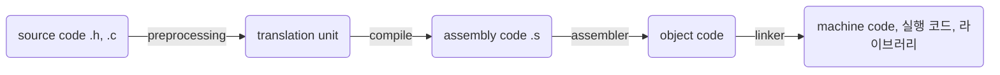

# clang_tutorial

<!--ts-->

-   [clang_tutorial](#clang_tutorial)
    -   [권고 사항](#권고-사항)
    -   [env settings](#env-settings)
    -   [clang command](#clang-command)
    -   [compiler](#compiler)
    -   [build process](#build-process)
    -   [module \& lib](#module--lib)
    -   [mem model](#mem-model)
    -   [mem issues](#mem-issues)
    -   [ptr, dereference](#ptr-dereference)
    -   [stdlib](#stdlib)
        -   [string.h](#stringh)
    -   [resources](#resources)
    -   [simple assembly](#simple-assembly)
    -   [registers](#registers)
    -   [what to do after basic c](#what-to-do-after-basic-c)

<!--te-->

## 권고 사항

-   전방 선언 꼭 해라. 함수 선언은 필수라 생각해라.
    -   C89 기준 아직 등장하지 않은 함수는 int 반환 함수로 컴파일러가 알아서 가정하기 때문임
-   한 줄에서 함수 여러 번 호출 하지 말 것 (unspecified behavior)
-   한 줄에서 동일 변수를 여러 번 바꾸지 말 것 (undefined behavior)
-   조건문에서는 short circuit evaluation 유의
-   전역 변수 prefix `g_` 붙이기
-   가급적 모든 변수에 const를 붙이는게 좋다. (rust 기본 동작처럼)
    -   변수가 기본이고 상수가 별도 표기하는 것이 아니라, 관점을 달리해서 기본이 상수로, 변수가 별도 표기하는 것이 좋다고 생각함. 문제는 C-lang와 그 영향을 받은 c-like language들이 이런 관점을 가지고 있지 않다는 것임.
-   build target (platform) 환경을 알아 두어라.
-   포인터를 반환하는 함수의 경우 dangling pointer를 조심하라. 함수 내 지역변수를 가리키는 포인터는 함수가 사라지면 stack frame 내에 의도한 값을 가지지 않을 가능성이 높다.
-   NULL이 될 가능성이 존재하는 것은 접미사로 `or_null`을 붙일 것
-   문자열은 순회하는 등 문자열의 길이에 의존하는 로직을 건드릴 때는 null char가 포함되어 있음을 염두에 두어라.
    -   {'a', 'b'}와 같은 꼴로 작성 된 경우 null char가 포함되어 있지 않으므로 주의하라. 애초에 이런 방식으로 문자열을 만들지 않도록 하자.

## env settings

[EditUsing Clang in Visual Studio Code](https://code.visualstudio.com/docs/cpp/config-clang-mac)  
[Visual Studio Code C++ July 2021 Update: Disassembly View, Macro Expansion and Windows ARM64 Debugging](https://devblogs.microsoft.com/cppblog/visual-studio-code-c-july-2021-update-disassembly-view-macro-expansion-and-windows-arm64-debugging/#disassembly-view)

## clang command

[clang docs](https://clang.llvm.org/docs/ClangCommandLineReference.html)

```bash
clang -std=c89 -W -Wall -pedantic-errors $file

clang -E $file # preprocessor output (translation unit)
clang -S $file # assembly output
clang -c $file # object output

# for your convenience
nodemon --exec "clang $file && ./a.out" -e c
```

## compiler

-   clang
    -   LLVM 컴파일러 구조를 사용하는 계열
    -   gcc 사용 인터페이스를 거의 비슷함. mac에서 gcc는 clang을 wrapping한 것일 정도.
    -   보통 이걸 쓰게 된다.
-   gcc (GNU Compiler Collection)
    -   거의 모든 표준 지원 + cross platform
-   MS visual C++
    -   cpp 컴파일러임에도 .c 확장자면 컴파일함.
    -   C99 표준. C11은 거의 지원하지 않음.
    -   window에서는 이 컴파일러를 사용하는 경우가 많음.

## build process



-   모든 c 파일을 컴파일하여 object code로 만들어 놓고 마지막에 linking 작업을 함

-   전처리(preprocessing)
    -   전처리기라는 별도의 프로그램이 담당하곤 함.
    -   주석 제거, 매크로 확장, include한 내용을 붙여 넣기 등.
    -   위 과정을 거쳐 만들어진 것이 확장된 소스 코드 = translation unit
-   compile
    -   assembly 언어를 뱉음. 특정 target platform에 종속적임.
-   assemble
    -   0과 1로 이루어진 기계어이긴 하지만 아직 linking을 거치지 않아 기계가 실행할 순 없음.
-   linker
    -   obj 코드를 모아 linking. 여러 obj 파일을 하나의 실행 파일로 만듦.

## module & lib

-   header(.h)와 c파일(.c)

    -   c 파일
        -   로직 코드 존재. 함수 정의, 전역 변수, 매크로 등.
    -   header 파일
        -   공유하고자 하는 것 정의. 함수 선언, 매크로, extern 등. #include 구문으로 포함함.

-   `#include <>` vs `#include ""`

    -   디스크 상 어디에서 header 파일을 찾는가?의 차이
    -   <>는 시스템 경로. 즉, C에서 제공하는 기본 라이브러리를 include할 때 주로 사용
    -   ""는 현재 work dir에서 먼저 찾고 없으면 시스템 경로에서 찾음.
    -   즉, 직접 만든 header는 ""로, 기본 라이브러리는 <>로 include 하자.

-   extern

    -   '외부 변수'. .h든 .c든 extern이 선언되면 '나 외부에 있는 것을 사용하겠다'는 의미.

-   static

    -   선언된 파일 내 혹은 블록 내에서만 사용할 수 있으며 extern으로 호출하여도 Undefined symbols 에러가 발생한다.
    -   `_s` 붙이는 컨벤션 권고.
    -   함수 내 선언된 static은 함수 호출이 끝나고 GC 당하지 않고 계속 유지 된다.
    -   static 변수를 선언하고, 해당 변수를 mutable하는 별도 함수를 만들어 호출하는 방법이 안전함. 일종의 setter 함수.

-   static library vs dynamic library

    -   정적 라이브러리는 라이브러리 + 내 코드가 합쳐져서 컴파일되고 실행 파일에 포함됨. 실행 파일이 커짐.
        -   즉, 정적 라이브러리는 만들어 놓고 코드에 복붙하는 것과 같다.
        -   실행이 빠른 장점이 있긴 함.
    -   동적 라이브는 이미 존재하는 내 실행 파일에서 실행할 때 lazy하게 동적 라이브러리를 로딩하여 링킹이 진행됨.
        -   실행하다가 필요한 코드를 건드리면 동적 라이브러리가 로드됨
        -   흔히 보는 `dll`이 `dynamic link library`의 약자임.
        -   여러 실행 파일들이 동일한 라이브러리를 공유하여 메모리를 절약할 수 있는 장점

-   circular header include
    -   include guard를 사용하자.
    -   #ifndef, #define, #endif를 사용하여 중복 include를 방지하는 것.
    -   #pragma once를 사용할 수도 있으나 표준은 아님.

## mem model

```
stack : 위(큰 주소)에서 아래(작은 주소)로
heap : 아래(작은 주소)에서 위(큰 주소)로
data
code
```

-   보통 개발하면서 신경쓰는 부분은 stack, heap이라 이 부분을 알아둬야.
-   process간 독립된 mem model을 지니고 있다면, thread는 stack을 제외한 영역을 공유한다.
-   stackless thread 사용하지 않는 이상 thread 생성 시 stack size를 지정할 수 있다.

-   `stack`

    -   스택은 매개 변수, 지역 변수가 저장되는 곳이다. 함수의 호출과 함께 할당되며 함수의 호출이 완료되면 해당 부분을 사용하지 않는다. 지우는 것도 컴퓨팅 리소스가 필요한 일이기에. 나중에 필요하면 덮어 쓰는 방식임. (함수 자체는 code에 올라가고, 함수 내 사용하는 변수들이 stack에 올라감)
    -   함수를 오고가면서 EBP, ESP를 옮겨가고 함수 내 변수 등은 그 사이인 stack pointer에 존재함
    -   스택 메모리의 크기는 프로그램 빌드 시(컴파일 타임)에 결정되며 스택 메모리의 위치는 실행 시(런타임)에 결정됨.
    -   변수를 선언하면 stack 영역에 할당된다고 알아두자.
    -   값형(value)를 call by value하면 스택에 복사본을 만듦.
    -   너무 큰 데이터는 stack에 넣으면 안된다. 이럴 때는 ‘동적 메모리 할당'하는게 좋다. os에게 메모리 달라고 부탁하는 것.
    -   `stack frame`
        -   각 함수가 사용하는 스택 메모리의 범위. EBP와 ESP 사이의 범위.
        -   함수 2개 정의해놓고 호출한다면 EBP, ESP 왔다갔다 하면서 stack frame 2개 정도 잡아놓고 쓰다가 호출 완료되면 쓰지 않는다.
        -   적극적으로 할당한 값을 메모리에서 지우지 않고 그냥 사용하지 않는다.
    -   `stack pointer`
        -   `EBP` (extended based pointer) : 스택 프레임의 첫 주소. Base라는 단어에 집중. → stack의 top. 현재 stack frame이 어디에 있는지 알게 해주는 포인터.
        -   `ESP` (extended stack pointer) : 현재 스택 포인터 → stack의 bottom. 현재 stack frame이 어디 까지 차 있는지 보여주는 포인터이기도 함.
    -   `call stack`
        -   stack 자료구조의 LIFO 특성이 stack 메모리에도 적용된다. 함수의 특성상 나중에 호출된 함수가 반환되지 않음녀 전에 쌓인 스택은 반환되지 않는다. 이런 특성을 이용해 함수의 호출과 반환을 관리하는 메모리 영역을 call stack이라고 한다.
        -   clang windows 기준 stack은 1MB 정도 된다고 한다. 얼마 되지 않기 때문에 재귀 호출할 때 탈출문을 제대로 작성하지 않으면 call stack 터지곤한다. stack 관점에서 보자면 함수 호출할 때마다 stack frame을 할당하는데 이게 계속 쌓이다보니 stack 메모리가 부족해져서 발생하는 문제다.

-   heap

-   data
    -   전역변수는 데이터 섹션에 저장
    -   문자열 리터럴은 일반적으로 프로그램의 데이터 섹션에 저장됩니다. 이러한 문자열은 읽기 전용(read-only)일 수 있으며, 프로그램 실행 중에 수정할 수 없습니다. 따라서 문자열 리터럴은 변경할 수 없는 상수(constant)로 취급됩니다.
-   code

## mem issues

-   memory stomp

    -   프로그램 내 다른 변수가 저장된 메모리를 덮어쓰는 것

-   segmentation fault의 원인
    -   null 값을 가리키는 포인터에 접근할 경우
    -   할당 받은 메모리 공간을 넘은 곳을 건드린 경우
    -   더 이상 존재하지 않는 메모리 영역을 가리킬 경우
    -   read-only 표시 메모리 영역에 쓰려고 할 경우

## ptr, dereference

-   pointer = 주소를 저장하는 변수 (참조)

    -   `int* p_num`과 `int *p_num`은 같다.
    -   int\* = pointer to int
    -   int\* = pointer to int\*
    -   x64에선 8byte, x86에선 4byte. 즉, word size 크기임.
        -   sizeof(short\*) == sizeof(double\*)
        -   ptr의 좌측 자료형은 해당 포인터가 무엇을 가리키고 있는 지에 대한 정보이지 크기를 나타내는 것이 아니다.
    -   call by value, call by reference 개념은 C에서 구분이 무익하다. 엄밀히 따지면 ptr 값을 복사해서 함수 내부에서 사용하는 것이다. 다만 메모리 주소를 통해 직접 값을 변경하기 때문에 그 변경이 원본에도 반영된다. 동작만 보면 call by reference와 같다. ptr를 함수에 넘겼음은 대부분 원본을 mutable하는 의도를 가졌을 것이다.
    -   타 언어에서 기본 자료형을 제외하고는 모두 포인터라 봐도 무방하다. instance, object, , list, arr, ...
    -   arr를 가리키는 ptr에 정수를 더하거나 빼는 것은 (++, -- 도 포함) 다음 원소 주소로의 이동을 의미한다. 배열을 가리키는 ptr에서 주로 사용되나 일반 값을 나타내는 ptr에서도 적용된다.

-   arr ptr

    -   ptr에 배열 할당하면 배열 첫 원소의 주소를 가리키는 ptr이 된다.

-   dereference(역참조)

    -   포인터가 가리키는 주소에 저장된 값을 가져오는 것
    -   역참조를 통해 값 변경을 가능

-   함수에서 포인터 변수를 반환할 때 주의하라.

    -   dangling ptr

        -   함수 내 지역변수가 존재하는 stack frame은 함수가 return되면 방치 된다. 추후 동작에 따라서 해당 메모리는 다른 것이 덮어 쓰게 된다.
        -   따라서 함수는 포인터 변수를 반환하면 안된다. 유효하지 않은 주소를 반환하기 때문이다.

    -   함수 반환 값이 ptr이어도 되는 경우
        -   전역 변수
        -   파일 속 static 전역 변수
        -   함수 내 static 변수
        -   heap에 생성한 데이터

-   null ptr

    -   (void\*)0을 가리키는 ptr
    -   null handling을 위해 assert, early return, 접미사 붙이기 등 프로그래밍 가시성을 높이자.
    -   역참조한 결과는 표준에 정의되지 않음.

-   const ptr
    -   `int* const`
        -   주소를 보호하는 ptr
        -   <u>포인터의 메모리를 고정하고 싶을 때 사용함. 메모리가 가리키는 값은 변경 가능</u>
            -   ```c
                int* const p = &a;
                *p = b; // ok
                p = &b; // error
                p++;    // error
                ```
        -   ptr = &new 꼴 불가.
    -   `const int*`, `int const*`
        -   값을 보호하는 ptr
        -   <u>포인터가 가리키는 값을 고정하고 싶을 때 사용함. 포인터가 담은 메모리 주소를 변경 가능</u>
        -   \*ptr = new 꼴 불가.
        -   ptr를 통한 값 변경을 막는 것이지 값 자체는 바꿀 수 있음.
            -   ```c
                const int* p = &a;
                a = 10; // ok
                p = &b; // ok
                *p = 5; // error
                ```
        -   직관적으로, const int가 정수 값 보호를 말하기에 const int\* 형태가 가장 많이 사용됨

## stdlib

https://en.cppreference.com/w/c

### [string.h](https://en.cppreference.com/w/c/string/byte)

-   전반적으로 'dest'가 의도보다 크기가 작다면 남의 메모리를 밟거나 컴파일이 되지 않는 등의 문제가 발생합니다.
-   C11에 `_s` 접미사가 붙은 secure 함수가 추가됨.
-   strcpy, strcat 등 작업 후 반환되는 문자열에는 무조건 마지막에 null char를 넣어주도록하자. null char가 원래 있었다면 상관 없고, 없었다면 위험한 문자열이기 때문이다.
-   C89에 n 붙은 메서드 제공 안함. C99부터 제공함.

-   strlen

    -   O(n)입니다. 그래서 가급적 C에서 문자열을 다룰 때는 문자열의 길이를 알고 있는 것이 좋습니다.
    -   strlen은 null char를 제외한 길이를 반환한다.

-   strcmp, strncmp

-   strcpy, strncpy
    -   전에 있던 dest는 덮어씌워지게 됩니다. dest의 크기가 src보다 작다면 문제가 발생합니다.
    -   기본적으로 null char를 붙여주려고는 하나 src의 길이가 n보다 큰 경우에는 null char를 붙여주지 않습니다.
    -   strncpy(dest, src, n)은 src 문자열에서 최대 n 개의 문자를 dest 문자열로 복사합니다.
        -   src의 길이가 n보다 작은 경우, 예를 들어 strncpy(dest, "ab", 5) 라면 나머지 공간을 \0를 붙입니다. 따라서 결과는 dest + "ab\0\0\0" 꼴이 됩니다.
        -   src의 길이가 n보다 큰 경우, 예를 들어 strncpy(dest, "abc", 1) 라면 dest + "a" 꼴이 됩니다. 그런데 이 경우에는 <u>null char를 붙여주지 않으므로 코더가 알아서 붙여야 합니다.</u>
-   strcat, strncat

    -   dest 문자열의 끝에 src 문자열을 붙입니다. dest의 크기가 src보다 작다면 문제가 발생합니다.
    -   strncat(dest, src, n)에서 dest에 남아 있는 공간이 n보다 적다면 의도치 않은 경과를 불러올 수 있습니다. 따라서, dest가 n만큼의 문자를 합칠 공간이 있는지 확인해야 합니다.

-   strstr

    -   char* strstr(const char* str, const char\* substr)
    -   substr이 str에 있으면 해당 substr이 시작하는 위치를 반환함. 없으면 null ptr
    -   즉, 찾은 문자열의 시작 위치를 알고 싶다면 반환한 포인터와 배열 포인터를 빼면 된다.

-   strtok

    -   타 함수와 다르게 예외적으로 원본 문자열을 변환한다.
    -   기본은 토크나이징이다.
    -   str내 포함된 delims들이 \0로 치환된다. 즉, strtok는 원본 문자열을 수정한다.

-   출력과 관련하여
    -   표준에서 stdin, stdout, stderr에 대한 버퍼링 표준이 존재하지 않음.
    -   line buffering, full buffering, unbuffering이 존재함. 일반적으로 line buffering이 default인 경우가 많은 듯 함.
    -   문자열 스트림이 없다. 대신 sprinf를 사용하자.

## resources

[dive into system](https://diveintosystems.org/book/index.html)

## simple assembly

cmp: compare  
je : jump if equal  
jz : jump if zero  
jg : jump if greater  
jl : jump if less  
xor : exclusive or  
pop : pop stack  
push: push stack  
call: call function  
ret : return from function  
mov : move (mov a,b는 b를 a에 대입하라는 의미)  
dec : decrement  
inc : increment

## registers

ebp : base pointer
esp : stack pointer

e.x 꼴을 따르고 있음  
eax : extended accumulator register
ebx : extended base register
ecx : extended counter register
edx : extended data register


## what to do after basic c

-   [pintOS](https://casys-kaist.github.io/pintos-kaist/introduction/getting_started.html)
    -   https://github.com/casys-kaist/pintos-kaist
-   build-your-own-x
    -   https://github.com/codecrafters-io/build-your-own-x
    -   https://build-your-own-x.vercel.app/
    -   [Build Your Own Redis with C/C++](https://build-your-own.org/)
-   [libuv](https://libuv.org/)
-   [cython](https://github.com/cython/cython)
-   [sqlite](https://sqlite.org/src/doc/trunk/README.md)
-   [learncpp](https://www.learncpp.com/)
