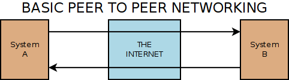
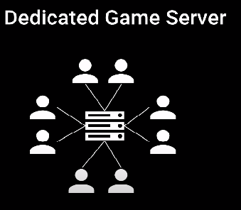

## Deterministic(결정론) 방식. 실시간 격투 게임이나 스타크래프트의 경우.

TCP/UDP/reliable UDP는 데이터를 전송하는 방식이다.

반면 데이터의 활용으로는 원리로는 **Deterministic 방식**과 **Server authority 방식**이 존재한다.

이 둘은 논리적으로 관련이 없지만 TCP는 Server authority, UDP는 Deterministic 방식과 짝지어 사용되곤한다.

### Deterministic 방식이란 무엇인가?

**입력이 같으면 결과(state)가 같다. = sync가 맞다.**

**그러기 위하여 같은 입력을 같은 시간에 넣어야 한다.**

이 정의 때문에 장단이 생긴다. **Deterministic 방식은 상대방의 state를 sync하는게 아니라 같은 input을 같은 시간 대에 넣으면 서로의 state가 sync될 것이라는 가정하에 작동**하는 것이라 Rollback이 까다로운 편이고, desync가 살짝이라도 나도 점차 차이가 벌어지게 된다.

### 시나리오

격투게임에서 인터넷을 통해 2명이 매칭이 되었다고 가정하자

p1 - internet - p2의 구조를 띄고 있을 것이다. (보통 이 구조를 p2p라 한다)



게임이 시작하자 p1이 펀치를 날렸고 그 다음으로 p2가 펀치를 날렸다.

그렇다면 다른 쪽의 서버에 도달하는 latency가 얼마인지는 관계 없이

(p1 → p2가 500m가 걸리고 p2 → p1가 100ms가 걸린다 하더라도)

(다만 p1 → p2, p2 → p1 latency는 같은 네트워크 경로를 탄다고 했을 때 거의 같다고 친다)

p1이 때리고 p2는 맞아야 한다. (p2의 펀치는 무효화)

Deterministic 방식으로 처리한다면,

p1이 먼저 펀치를 날렸고 그 이후에 p2가 날렸다는 ‘입력’이 p1, p2의 컴퓨터 모두에게 같아야 하고

따라서 그 결과도 ‘결과론적’으로 p1가 때리고 p2가 맞는 방식으로 같아야 한다.

이러한 결과를 가져오려면 각 서버에 전송하는 latency를 어떻게 처리할 것이느냐가 관건이다.

## Deterministic 방식에서 latency를 처리하고 state를 sync하는 방법 : Delay, Rollback

### Delay : 입력에 network latency 만큼 딜레이를 주기

p1 → p2 latency가 100ms라면 p1의 입력 시간과 p2가 받는 시간 사이의 간격이 100ms라는 것이므로

**p1이 누른 시간 + latency(100ms) = p2 서버에 닿는 시간**이 된다.

**따라서 요청 서버와 응답 서버의 입력이 같은 시간에 이루어지게 된다.**

다만 딜레이는 100ms 정도가 사용자 경험에 한계로 봄… 200ms는 유저에게 먹먹한 느낌을 줌.

내가 펀치 날리라고 키보드 눌렀는데 200ms 이후에 나간다고 보면 뭔가 반응이 느리다는 걸 느낄 것이다.

구체적으로는 다음과 같이 밀릴 프레임이 계산된다.

```
InputDelayFrames = Ceiling( (RoundTripLatency + Constant) / (2 * FrameDuration) )
- https://web.archive.org/web/20210228051849/http://mauve.mizuumi.net/2012/07/05/understanding-fighting-game-networking.html
```

추가적으로 높은 우선순위를 가진 blocking thread에서 패킷을 받아야 Delay를 적용한 게임에서도 높은 반응성을 유지할 수 있다.

### Rollback

latency가 너무 길면 delay만으로 게임을 운용할 수는 없게 된다.

응답이 오면 해당 응답의 latency 만큼 시간을 뒤돌려서 sync를 맞추는 방식임.

**p2가 받은 시간 - latency(100ms) = p1가 보낸 시간**

**따라서 요청 서버와 응답 서버의 입력이 같은 시간에 이루어지게 된다.**

그런데 Rollback을 당하는 유저 입장은 ‘튀었다’라고 느낀다. 화면상으로 먼저 때렸는데 내가 맞았다던지 갑자기 캐릭터가 저 쪽에 순간 이동해있다던지로 보이게 된다.

또, delay에 비해 rollback은 코딩의 복잡성이 높다. Deterministic 방식은 상대방의 state를 sync하는게 아니라 같은 input을 같은 시간 대에 넣으면 state가 sync가 이루어질 것이라는 가정하에 작동하는 것이다. 그래서 input을 하나하나 되돌려야 한다.

rollback은 제한적으로 사용해야하고 유저가 눈치 채지 못할 정도로만 사용해야 한다.

rollback의 까다로움 때문에 이걸 해주는 미들웨어 제품이 따로 있기도 하다. 격투게임에서 대표적으로 GGPO가 있었다.

https://www.ggpo.net/

## Relay server(중계 서버, broadcast server)를 이용한 Deterministic 방식



입력을 직접 대상 서버에 보내는 것이 아닌 중개 서버에 보낸 후, 중개 서버가 각 대상 서버에게 뿌리는 방식이다.

그래서 모든 클라이언트가 중개 서버에서 입력을 받게 되므로 같은 latency를 가지게 되고 Deterministic 방식으로 작동하게 된다.

중개 서버는 시간 별로 쪼개서 gathering한 input을 주기적으로 연결된 각 클라이언트에게 보내주게 된다.

중개 서버를 통한 Deterministic 방식은 직접 통신보다 desync가 덜 일어나는 장점이 있다.

단점은, 실제 패킷을 목적지로 바로 가는 것이 아니다보니 latency가 크고, delay 방식 까지 적용할 경우 반응성이 좋지 못하다는 것

그래서 반응성이 덜 중요한 게임에서 주로 사용된다.

## p2p 통신을 위해 NAT을 뚫는 홀펀칭(hole punching)

**홀펀칭은 NAT라는 네트워크 장비를 두고 있어서 직접적인 TCP/UDP 통신이 불가능한 Peer들간에 직접적인 통신이 가능할 수 있도록 (IP, PORT) 확보하는 것을 말한다.**

즉, NAT이 있다면 egress는 되지만 ingress는 안되는데 어떻게 NAT을 뚫고 p2p 통신을 할 수 있는 것일까? → 홀펀칭

홀펀칭이 필요한 이유는 P2P (Peer-to-Peer) 기반의 게임이나 통신 방식에서는 클라이언트끼리 직접 연결을 맺고 통신을 진행하여야 하는데, 참여하는 클라이언트가 NAT 하위에 존재한다면 직접 연결이 불가능하기 때문이다. 요즘같이 유무선 공유기가 일반화가 된 환경에서는 P2P 게임이나 서비스를 제공하려는 경우에는 필수적인 기술이라고 할 수 있겠다.

홀펀칭의 과정을 좀 더 자세하게 알아보자.
Client A와 B의 p2p 통신을 한다고 가정해보자.

```text
Client A[private ip] → Gateway A[public ip] ←→ Gateway B[public ip] ← Client B[private ip]
```

-   NAT의 외부에 `stun 서버` (Session Traversal Uilities for NAT, stun)를 둔다

    -   NAT 하위 peer는 stun 서버에게 요청을 보내 내가 어떤 public ip, port를 사용하는 지 알게 된다.
        -   그러나 연결하고자 하는 peer가 같은 NAT 환경에 있는 등의 조건으로 stun 서버가 실패할 때도 있다.
    -   public ip, port 정보를 p2p를 관리하는 중앙에 있는 서버에 저장해두고, 서로 connection을 맺어야 할 때 해당 정보를 내려다 준다.
        -   잠깐, ‘중앙 서버’라고? 그렇다. p2p에서도 피어 탐색을 위한 중앙 서버란게 존재한다.
        -   다만, 중앙 서버 없는 피어 탐색 기술도 존재하긴 한다.
    -   다른 NAT 하위에 존재하는 peer와 p2p 통신을 맺기 위해 다음과 같이 진행한다.
        -   일단 사설 IP/PORT로 더미 패킷을 전송하고 응답을 기다려 본다. → 응답오면 해당 정보로 접속 시도 (되겠냐?)
        -   위 과정이 실패하면 공인 IP/PORT로 동일한 작업을 수행한다. → 응답오면 해당 정보로 접속 시도 (홀펀칭 성공)
        -   안되면 홀펀칭이 실패한 것이므로 turn 서버를 통해서 연결을 맺어야 한다.

-   홀펀칭이 실패하였다면 relay server를 turn 서버 (Traversal Using Relays around NAT)로 사용하여 연결해야 한다.
-   정리하자면 stun 서버 통해서 알게된 곳으로 쏴보고 홀펀칭이 되면 직접 소통하고 안되면 turn 서버를 거쳐야 한다는 것이다.

-   https://www.netmanias.com/ko/post/blog/6263/nat-network-protocol-p2p/p2p-nat-nat-traversal-technic-rfc-5128-part-2-udp-hole-punching

## server authority 방식 (C/S 방식)과 동접이 많은 MMORPG의 경우 멀티 스레딩 서버 관리

고전적인 방식이다. 간단히 클라이언트가 서버에게 요청 보내고, 서버가 응답 보내는 간단한 구조이다. 대부분의 웹 서버가 C/S 방식이다.

단, 게임 서버가 웹 서버와 다른 점은 connection을 계속 유지해야 한다는 점 + connection이 매우 많다는 점이다.

MMORPG의 경우 동접자들의 커넥션과 요청 패킷을 서버에서 다 처리해야 한다는 것인데 그래서 서버가 C10K(커넥션 1만개!) 문제를 겪을 가능성이 높다.

그런데 서버는 핸들링 해야 하는 커넥션이 많으므로 blocking 방식으로 작동하면 나머지 커넥션이 다 기다려야 하기 때문에 non-blocking 으로 작동해야 한다. 특히, single thread인 방식에서 event loop를 block하면 다 막힌다.

blocking한 작업들은 다른 쓰레드로 빼서 사용하도록 하자.

게임 서버는 크게 하는 일은 크게 다음 두 가지이다.

1. 패킷 처리
2. tick (틱레이트는 단위 시간 당 맵의 변화와 유저와 맵의 상호 작용에 대한 업데이트 빈도를 나타내는 수치입니다)

5000명의 동접을 받는 서버 프로세스는 5000명 유저와의 커넥션을 담당해야 하며, 1 tick 당 5000명 + NPC 등 모든 actor의 연산 처리를 끝내야 한다. 이렇게 계산을 때리면 거의 한 처리당 0.02ms (초가 아니라 ms) 안에 해야 하는 하드코어한 기능을 수행해야 한다.

그래서 작업을 분산하기 위해 actor의 수가 많은 게임 서버는 멀티 쓰레딩을 반드시 해야 한다.

-   worker thread를 싱글 스레드로

    -   worker thread가 1개란 말임. network i/o 담당하는 thread는 또 있음
    -   network i/o thread에서 가져온 정보를 queue에 담고 매 tick마다 worker thread가 다 처리해야 한다.
    -   이 구조는 단순하고, 멀티 쓰레드에서 발생하는 이슈들이 없다는 장점이 있다.
    -   단점은 싱글 스레드라서 많은 Actor를 처리할 수 없다. 그래서 이런 서버는 동접은 1000명 정도 버틸 수 있음.
    -   생각보다 소규모에서는 많이 사용함. 과거 MMORPG에서나 쓰임.

-   worker thread를 싱글 스레드 + dedicate 스레드

    -   db i/o 등 지정된 특정한 용도의 다른 thread를 추가하는 방식임. 싱글 스레드 방식의 변형이라고 봐야.
    -   worker thread의 부담을 일부 줄여줄 수 있다는 장점.
    -   그래도 여전히 5000명 이상은 어렵다고 함.

-   worker thread를 여러 멀티 쓰레드로
    -   network i/o thread에 가져온 queue를 각자 worker thread가 가져가서 처리하는 방식임.
    -   멀티 쓰레드 문제가 발생함. queue에서 뽑아갈 때 locking 문제 발생 나기도 하고 잘 못 짜면 싱글 스레드만도 못한 성능을 낼수도.
    -   그래서 그냥 멀티 프로세스하고 프로세스 당 스레드 1개 씩만 처리하기도 함. 멀티 프로세스의 문제는 메모리 공유 부분이 없어서 actor간 interaction이 안된다는 건데, 게임 설계에 따라서 이렇게 해도 되는 경우도 있음.
