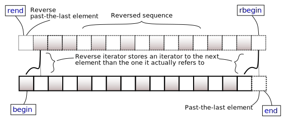

<!-- toc -->

- [STL(standard template library)](#stlstandard-template-library)
  * [STL container](#stl-container)
    + [vector. 동적 배열](#vector-%EB%8F%99%EC%A0%81-%EB%B0%B0%EC%97%B4)
    + [map](#map)
    + [set](#set)
    + [queue](#queue)
    + [stack](#stack)
    + [deque](#deque)
    + [list](#list)

<!-- tocstop -->

# STL(standard template library)

## STL container

https://en.cppreference.com/w/cpp/container

### vector. 동적 배열

https://en.cppreference.com/w/cpp/container/vector

-   메모리 연속성
    vector 자료구조는 메모리 상 원소들이 연속된 공간에 존재.

-   reallocations
    이러한 자료 구조가 동적이기 위하여 원소 수가 한계 이상이 되면 메모리 공간을 전부 옮겨야 함.

-   capacity (cap)
    the total number of elements that the vector can hold without requiring reallocation

-   size
    실제로 존재하는 원소의 갯수. capacity를 넘어가는 순간 realloc 발생.

-   complexity
    배열과 같으므로 임의 원소 접근 O(1)  
    삽입 및 삭제에 대해서도 배열과 같이 이동 과정이 있으므로 O(N)  
    Random access - constant 𝓞(1).  
    Insertion or removal of elements at the end - amortized constant 𝓞(1).  
    Insertion or removal of elements - linear in the distance to the end of the vector 𝓞(n).

-   iterator, reverse_iterator

    begin/end 조합은 앞에서부터
    rbegin/rend 조합은 뒤에서부터 조회하기 위한 도구임.

    vector<T>.end()가 요소의 마지막이 아닌 `마지막 한 칸 뒤`을 가리킴에 주의.  
    마찬가지로 r.end()는 요소의 처음이 아닌 `맨 앞에서 한 칸 앞`을 가리킴.

    

-   insert
    삽입된 값을 가리키는 반복자가 반환됨.

-   erase
    the end() iterator (which is valid, but is not dereferenceable) cannot be used as a value for pos.

    -   return 값이 독특함
        -   지운 후 해당 위치를 가리키는 반복자를 반환함.
        -   예외: 마지막 원소를 지우는 경우, 마지막 원소를 가리키는 반복자가 아닌 v.end()를 반환함.

-   tips
    vector 생성하고 바로 reserve로 cap 잡아라.

### map

### set

### queue

-   queue

    -   큐가 비었는데 front나 back이나 pop을 호출하면 런타임 에러
    -   front [a, b, c, ...] <- push back
    -   pop은 가장 앞 (front) 원소 제거(즉, pop 메서드가 stack과 다르다. 그것이 queue니까...)

### stack

-   stack

    -   스택이 비어있는데 top, pop을 호출하면 런타임 에러
    -   [a, b, c, ...] <- push
    -   pop은 가장 뒤 (push 되는 쪽) 원소 제거. top은 최후방 원소 반환

### deque

-   deque
    -   double ended queue
    -   front [a, b, ...] back
    -   vector와 deque와의 큰 차이점 : 연속의 유무.
        -   vector의 경우 공간이 부족하면, memory reallocate 과정을 거쳐야 하는데 deque의 경우 연속되지 않으니, 그냥 새로운 memory block 을 하나 할당하면 되니 평균적인 성능을 보장할 수 있음.

### list

-   list(circular doubly linked list)
    -   list<T>::iterator는 list 메서드에 의해 자동으로 보정되지 않는다.
        -   list<T>의 iterator는 코더의 의도하지 않은 삭제되거나 이동된 원소를 가리키고 있을 수 있다. 메모리에서 해당 원소 자체가 삭제되는 것이 아니기에. 따라서 대부분의 경우 `iter = list.erase(iter)`, `iter = list.insert(iter)` 와 같이 사용하기를 원할 것이다.
        -   insert 함수는 insert한 원소를 가리키는 iterator를 반환합니다
        -   erase 함수는 지워진 원소의 다음 원소를 가리키는 iterator를 반환. 빈 리스트나 마지막 원소를 지우려는 경우 에러 발생
            -   Thus the end() iterator (which is valid, but is not dereferenceable) cannot be used as a value for pos.
                -   ```cpp
                        list<int> l = {1};
                        list<int>::iterator i = l.end(); // i는 실제 데이터가 아닌 리스트의 끝을 나타내는 특별한 위치.
                        // 실제 원소 3을 지우기 위하여 --i를 통해서 원소 3을 가리킴.
                        // 그 결과 l.erase는 3을 지우게 되고 3의 다음 원소를 반환할 것으로 예상됨.
                        // 그러나 3의 다음 원소는 없음.
                        // 이 경우 문서를 읽어보면
                        // If pos refers to the last element, then the end() iterator is returned.
                        i = l.erase(--i);
                        // 마지막 원소를 지운 경우 똑같이 마지막을 반환함.
                        cout << *i << endl; // 2
                    ```
-   list.end는 실제 데이터가 아닌 리스트의 끝을 나타내는 특별한 위치를 가리킴. 몇 컴파일러에서는 알아서 보정을 해줍니다만 여기에 의존하지 않는 것이 좋습니다.

    -   ```cpp
            int main(void) {
            list<int> l = {1, 2};
            list<int>::iterator cur = l.end();
            cout << *cur << endl;     // 2 (UB)
            cout << *(--cur) << endl; // 2 (의도된 것)
        }
        ```
